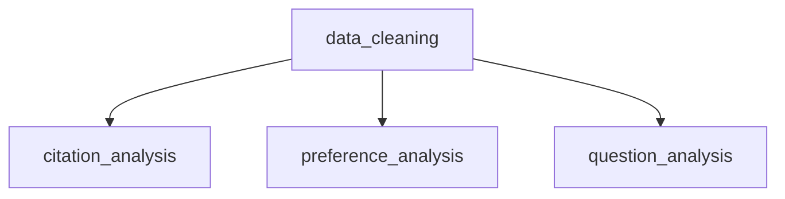

# Workflow Directory

This directory contains all Snakemake-based data processing pipelines for the AI Search Arena Citation Analysis project.
The workflows are designed to be modular, reproducible, and scalable.

## 🏗️ Pipeline Architecture

```
workflow/
├── 🧹 data_cleaning/           # Core data extraction & normalization
└── 📊 analysis/               # Analysis pipelines (run after data_cleaning)
    ├── citation_analysis/    # News citation patterns & bias analysis
    ├── preference_analysis/  # User preference modeling
    └── question_analysis/    # Question topic analysis
```

## 🔄 Pipeline Dependencies

### Execution Order (Required)


**Critical**: The `data_cleaning` pipeline must be completed before running any analysis pipelines.

## 📋 Pipeline Details

### 1. Data Cleaning Pipeline (`data_cleaning/`)

**Purpose**: Extract and normalize raw search arena data into relational tables

**Input**:
- `data/raw_data/search-arena-chat-24k.parquet` (24k conversations)
- Domain metadata files (political leaning, quality ratings)

**Output**:
- `data/intermediate/cleaned_arena_data/`
  - `threads.parquet` (24,069 conversation threads)
  - `questions.parquet` (32,884 user questions)
  - `responses.parquet` (65,768 AI responses)
  - `citations.parquet` (366,087 web citations) ⭐ **Primary analysis target**

**Key Features**:
- 35-test validation suite with 97.1% pass rate
- Referential integrity enforcement
- Dual domain extraction (full + base domains)
- Complete metadata preservation

**Runtime**: ~5-10 minutes on single core

**Usage**:
```bash
cd workflow/data_cleaning
snakemake --cores 1
```

### 2. Citation Analysis Pipeline (`analysis/citation_analysis/`)

**Purpose**: Analyze citation patterns, political bias, and source quality

**Dependencies**: `data_cleaning` pipeline completion

**Key Analyses**:
- **Domain Classification**: Categorize domains (news, academic, gov, etc.)
- **Political Bias Analysis**: News source political leaning patterns
- **Source Quality Analysis**: Credibility and reliability metrics
- **Model Comparison**: Citation behavior across AI models
- **News Statistics**: Comprehensive news citation reporting

**Outputs**:
- LaTeX tables for publication (`overrepresented_sources_latex_table.tex`)
- Statistical reports (`news_citation_statistics_report.md`)
- Visualization data for notebooks

**Runtime**: ~10-15 minutes

**Usage**:
```bash
cd workflow/analysis/citation_analysis
snakemake --cores 1
```

### 3. Preference Analysis Pipeline (`analysis/preference_analysis/`)

**Purpose**: Model user preferences and citation effects on choices

**Dependencies**: `data_cleaning` pipeline completion

**Key Analyses**:
- **Bradley-Terry Modeling**: Statistical ranking of AI models
- **Citation Style Effects**: How citation patterns affect user preferences
- **News Competition Analysis**: Head-to-head news citation comparisons
- **Individual Effects**: Model-specific preference patterns

**Outputs**:
- Bradley-Terry ratings and coefficients
- Statistical significance tests
- Effect size visualizations
- Comprehensive HTML reports

**Runtime**: ~15-20 minutes

**Usage**:
```bash
cd workflow/analysis/preference_analysis
snakemake --cores 1
```

### 4. Question Analysis Pipeline (`analysis/question_analysis/`)

**Purpose**: Analyze user questions and their relationship to citations

**Dependencies**: `data_cleaning` pipeline completion

**Key Analyses**:
- **Topic Modeling**: BERTopic clustering of user questions
- **Language Filtering**: English question identification
- **Citation Patterns**: Question type vs. citation behavior
- **Regression Analysis**: Statistical modeling of question factors
- **Feature Engineering**: Question metadata extraction

**Outputs**:
- Topic model results and probabilities
- Question embeddings and features
- Regression coefficients (LaTeX tables)
- Comprehensive analysis reports

**Runtime**: ~20-30 minutes (includes embedding generation)

**Usage**:
```bash
cd workflow/analysis/question_analysis
snakemake --cores 1
```

### 5. YouTube Analysis Pipeline (`analysis/youtube_analysis/`)

**Purpose**: Analyze YouTube-specific citations and channel metadata

**Dependencies**:
- `data_cleaning` pipeline completion
- YouTube API key (optional, for fresh data)

**Key Analyses**:
- **YouTube URL Extraction**: Identify YouTube citations
- **Video Metadata**: Title, description, view counts
- **Channel Analysis**: Subscriber counts, channel types
- **Citation Integration**: YouTube data with main citation tables

**Outputs**:
- YouTube citation tables
- Video and channel metadata
- API response caches (for rate limit management)

**Runtime**: ~30-60 minutes (depending on API calls)

**Usage**:
```bash
cd workflow/analysis/youtube_analysis
snakemake --cores 1
```

**Note**: YouTube API key required for fresh data collection. Pre-computed data available.

### 6. Leaderboard Replication (`leaderboard_replication/`)

**Purpose**: Replicate official AI Search Arena leaderboard rankings

**Dependencies**: `data_cleaning` pipeline completion

**Key Features**:
- Feature engineering for model ranking
- Bradley-Terry implementation
- Leaderboard score calculation
- Validation against official rankings

**Runtime**: ~5-10 minutes

## ⚙️ Configuration Management

### Configuration Files
Each pipeline includes a `config/config.yaml` file with:
- Input/output paths
- Analysis parameters
- Model specifications
- Processing options

### Environment Variables
- `YOUTUBE_API_KEY`: Required for YouTube analysis (optional)
- Other API keys loaded via `.env` file (not committed)

## 🔧 Running Workflows

### Individual Pipelines
```bash
# Core data extraction (required first)
cd workflow/data_cleaning && snakemake --cores 1

# Citation analysis
cd workflow/analysis/citation_analysis && snakemake --cores 1

# User preference analysis
cd workflow/analysis/preference_analysis && snakemake --cores 1

# Question analysis
cd workflow/analysis/question_analysis && snakemake --cores 1

# YouTube analysis (optional)
cd workflow/analysis/youtube_analysis && snakemake --cores 1
```

### Parallel Execution
```bash
# Use multiple cores for faster processing
snakemake --cores 4

# Dry run to check dependencies
snakemake --cores 1 --dry-run

# Force re-run of specific rules
snakemake --cores 1 --force-run target_rule
```

### Full Reproduction
```bash
# Run master script (see workflow/run_all_pipelines.sh)
bash workflow/run_all_pipelines.sh
```

## 📊 Output Organization

### Intermediate Data
```
data/intermediate/
├── cleaned_arena_data/     # Core normalized tables
├── citation_analysis/      # Citation analysis results
├── preference_analysis/    # User preference models
├── question_analysis/      # Question analysis data
└── youtube_analysis/       # YouTube-specific data
```

### Final Outputs
```
data/output/
├── citation_analysis/     # LaTeX tables, reports
├── preference_analysis/   # Model coefficients, visualizations
├── question_analysis/     # Regression tables, topic results
└── cleaned_arena_data/    # Summary statistics, figures
```

## 🧪 Testing & Validation

### Data Validation
- Automated testing in `data_cleaning/scripts/validate_extraction.py`
- Cross-table referential integrity checks
- Data quality metrics and reports

### Pipeline Testing
```bash
# Test individual pipeline
cd workflow/data_cleaning
snakemake --cores 1 --dry-run

# Validate outputs
python scripts/validate_extraction.py
```

## 🚨 Troubleshooting

### Common Issues
1. **Missing input data**: Ensure raw data is downloaded
2. **Import errors**: Check Python environment and requirements
3. **Memory issues**: Some analyses require 8GB+ RAM
4. **API limits**: YouTube API has daily quotas

### Performance Optimization
- **Use `--cores 4`** for parallel processing
- **Sample data** for development/testing
- **Cache intermediate results** to avoid recomputation
- **Monitor memory usage** for large datasets

### Resource Requirements
- **Memory**: 8GB RAM recommended (16GB for full datasets)
- **Storage**: 5GB free space for intermediate files
- **CPU**: Multi-core recommended for faster processing
- **Network**: Required for API calls (YouTube analysis)

## 📚 Script Documentation

Each pipeline directory contains:
- **`Snakefile`**: Main workflow definition
- **`config/config.yaml`**: Configuration parameters
- **`scripts/`**: Individual analysis scripts
- **`*.md`**: Analysis plans and documentation

### Script Organization
- **Atomic scripts**: Each performs single, well-defined task
- **Clear inputs/outputs**: Defined via Snakemake rules
- **Error handling**: Robust error checking and logging
- **Documentation**: Inline comments and docstrings

---

**Next Steps**: After running pipelines, use Jupyter notebooks in `notebooks/` for visualization and paper figure generation.